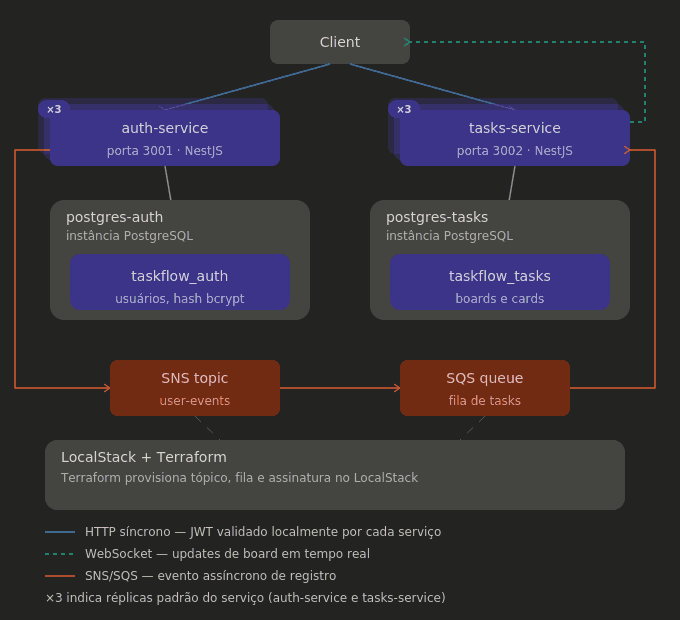
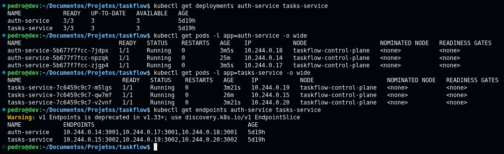
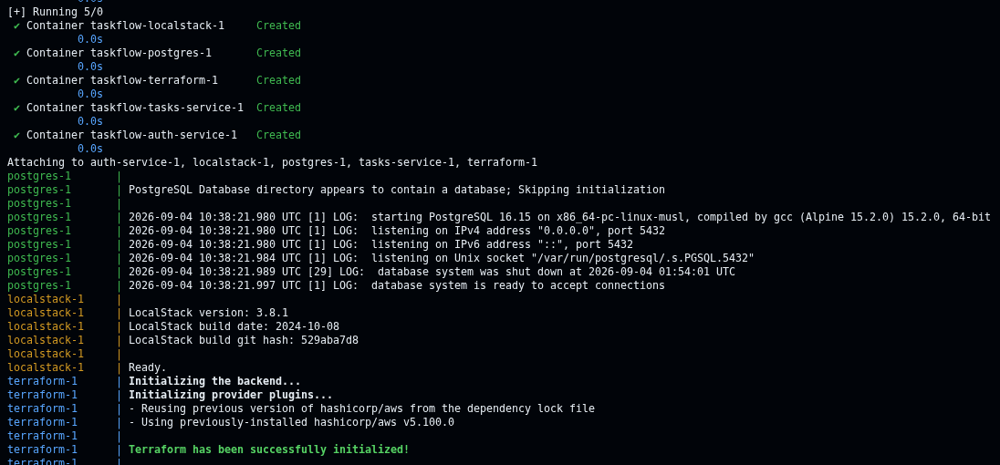
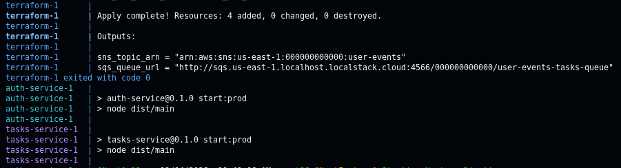
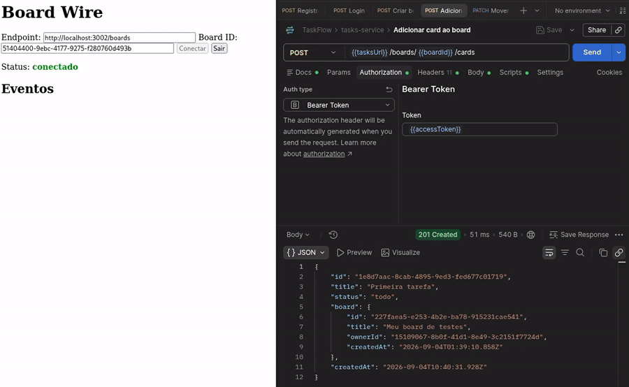

English · [Português](README.pt-BR.md)

# TaskFlow

Microservices study project with NestJS. Two separate services,
auth-service and tasks-service, each with its own Postgres instance.
Shared JWT authentication between them, asynchronous communication
via SNS/SQS (simulated with LocalStack), real-time updates via
WebSocket, infrastructure with Terraform and Kubernetes, and everything also
runs via Docker Compose.



On Kubernetes, auth-service and tasks-service run with 3 replicas by default.



### For the full build
```bash
docker-compose up --build
```

infra coming up (postgres, localstack, terraform applying the resources) and both services starting.




### To run the services on the host
```bash
# infra (postgres + localstack + terraform)
docker-compose up -d postgres-auth postgres-tasks localstack terraform

# each service in its own terminal
cd auth-service && npm run start:dev
cd tasks-service && npm run start:dev

# e2e tests
cd auth-service && npm run test:e2e
cd tasks-service && npm run test:e2e
```

WebSocket test page: **http://localhost:3002/board-wire**



## Routes

### auth-service — port 3001, no authentication

`POST /auth/register`

```json
{
  "name": "string",
  "email": "string",
  "password": "string, minimum 8 characters"
}
```

Returns `{ id, email, name }` and fires the `UserRegistered` event on SNS.

`POST /auth/login`

```json
{
  "email": "string",
  "password": "string"
}
```

Returns `{ accessToken }`.

### tasks-service — port 3002, all routes require `Authorization: Bearer <accessToken>`

`POST /boards`

```json
{
  "title": "string",
  "ownerId": "string"
}
```

Returns the created board. A new user's default board is created exactly this way, by the SqsConsumer processing the registration event.

`POST /boards/:boardId/cards`

```json
{
  "title": "string"
}
```

Returns the created card (status starts as `todo`) and emits `cardCreated` over WebSocket.

`PATCH /boards/:boardId/cards/:cardId`

```json
{
  "status": "todo | doing | done"
}
```

Returns the updated card and emits `cardMoved` over WebSocket.

`GET /board-wire`

No payload. Serves the WebSocket test page (`tools/board-wire.html`).

## Asynchronous communication and real time

infra/terraform: LocalStack simulating SNS/SQS, creates the "user-events"
topic, the "user-events-tasks-queue" queue, and the subscription between the
two.

The SqsConsumer runs in a background loop (polling), outside the lifecycle of
an HTTP request. MikroORM blocks use of the global EntityManager outside that
cycle by default, to avoid unwanted concurrency between simultaneous
requests — that's why allowGlobalContext: true is set in the config.

auth-service
SnsPublisher (@aws-sdk/client-sns): publishes "UserRegistered" after a successful registration
AuthService injects the publisher and calls it inside register()

tasks-service
SqsConsumer (@aws-sdk/client-sqs): long-polling the queue since boot, and on receiving "UserRegistered" creates the default board for the user

Before: registering a user only created the user, tasks-service had no idea it existed
Now: registration publishes an event → tasks-service consumes it → default board gets created on its own, no HTTP call involved

boardGateway (WebSocket, /boards namespace): one room per board (board:<id>), emits cardCreated and cardMoved
boardsService calls it after every mutation

DevToolsController: GET /board-wire route, serves a test page (tools/board-wire.html) that connects to the gateway and shows the events live

Before: creating/moving a card only responded to the client that made the request
Now: any client with that board open over WebSocket gets the update with no refresh

## Tests

e2e tests in test/*.e2e-spec.ts in both services. No isolated test database, test emails use a timestamp.

describe/it/beforeAll/afterAll/expect are globals injected by Jest at
runtime, they don't come from any import. That's why tsconfig.spec.json
needs an explicit "types": ["jest", "node"] (TS 6 stopped auto-including
@types/* on its own).

tsconfig.spec.json exists separately from the main tsconfig.json because the
latter got "exclude": ["test"] added (otherwise the app's nest build would
try to compile the specs too). The spec config frees up rootDir and brings
test/ back in, just for itself.

Jest runs in ESM mode (NODE_OPTIONS=--experimental-vm-modules,
useESM: true) — @nestjs/common@12 and friends are now pure ESM ("type":
"module", no CJS build), and Jest in default mode can't require() that.

tasks-service/test/boards.e2e-spec.ts swaps the real SqsConsumer for a stub
(overrideProvider(SqsConsumer).useValue({ onModuleInit: () => {} })) — the
real one enters an infinite polling loop as soon as the app boots, and
without this Jest would never finish running.

The same file signs a test JWT (jwt.sign(..., process.env.JWT_SECRET))
instead of actually logging in through auth-service. tasks-service only
validates tokens, it doesn't issue them, which keeps its tests independent.

## Terraform

infra/terraform/ replaces the old localstack-init.sh script — the same
resources (SNS topic, SQS queue, subscription between them) are now declared
in HCL instead of awslocal commands. The aws provider points at LocalStack
with the same credentials (access_key/secret_key) the services already use,
and the skip_* flags turn off the AWS account validation the provider would
try to do by default.

Running it on its own is automatic now: there's a "terraform" service right
in docker-compose.yml (hashicorp/terraform image) that runs init+apply and
exits — auth-service/tasks-service only start after it finishes successfully
(depends_on: condition: service_completed_successfully). A single
docker-compose up --build already does everything on its own, no manual step
needed.

The LocalStack endpoint changes depending on where Terraform runs — inside
compose it talks to the "localstack" container by name (Docker's internal
network), on the host it talks to localhost. That's the
localstack_endpoint variable in variables.tf, passed via
TF_VAR_localstack_endpoint in compose. Same pattern the Node services already
use for AWS_ENDPOINT.

To run/iterate by hand, without compose (useful while editing the .tf):

cd infra/terraform
terraform init    # downloads the aws provider, only needed the first time
terraform plan    # shows what would change, without applying anything
terraform apply   # actually creates it — uses localhost:4566 by default

The old script didn't have aws_sqs_queue_policy. Without it, on a real AWS
account SNS wouldn't have permission to publish to the queue (the
subscription alone isn't enough).

The apply takes about 50s the first time (aws_sqs_queue and
aws_sqs_queue_policy, about 25s each) — that's not LocalStack. It's
Terraform's own provider polling every 5s before it considers the resource
created.

## Kubernetes

infra/k8s/: the same stack as docker-compose, just orchestrated by a local
cluster (kind) instead of compose

postgres-auth, postgres-tasks (compose) -> one StatefulSet + PersistentVolumeClaim
each, fully separate instances (they always need to come back to the same
disk, unlike auth/tasks-service which hold no state at all)
localstack, auth-service, tasks-service (compose) -> Deployment + Service
auth-service and tasks-service default to 3 replicas each (stateless, safe
to run more than one); localstack stays at 1, its SQS/SNS state only lives
in that single instance's memory
terraform (the one-shot compose service) -> Job, with an initContainer
waiting for localstack to respond (Jobs have no native depends_on)
environment: (compose) -> ConfigMap (whatever isn't a secret) + Secret
(password, JWT_SECRET, AWS credentials)

to run:

kind create cluster --name taskflow
kind load docker-image taskflow-auth-service:latest taskflow-tasks-service:latest --name taskflow
kubectl apply -f infra/k8s/

the images need to already exist locally beforehand (docker-compose build,
or a direct docker build). kind doesn't pull from docker-compose on its
own, it only loads whatever's already been built.

to test it (a Service alone is only reachable from inside the cluster):

kubectl port-forward svc/auth-service 3001:3001
kubectl port-forward svc/tasks-service 3002:3002

terraform-configmap.yaml is generated from the .tf files (kubectl create configmap --from-file)

scaling horizontally from that default is just one command, no code changes
or rebuild needed:

kubectl scale deployment tasks-service --replicas=5

tasks-service's WebSocket gateway keeps its connections in memory per pod,
with no shared adapter between replicas, so a card update can miss a client
connected to a different pod than the one that made the change. Not an
issue for auth-service, which has no in-memory state to begin with.
